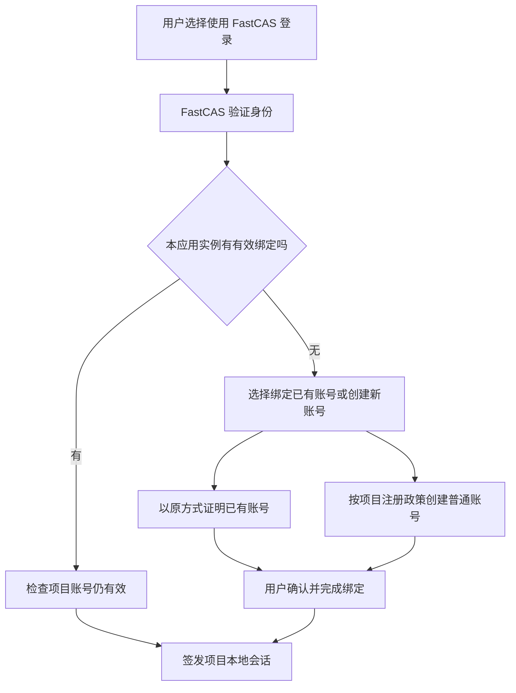

# 产品形态与用户流程

## 核心约定

本设计已按用户补充要求调整：**各项目不必依赖 FastCAS 才能登录/注册；可以认证已有账号，也可以用 FastCAS 登录。**

三个对象分别负责不同事情：

- **项目账号 LocalAccount**：项目持有的用户 ID、凭证、状态、工作区和资源权限。
- **FastCAS 身份 Identity**：跨项目可复用的身份，使用稳定 `issuer + subject` 标识。
- **认证绑定 AccountLink**：用户证明同时控制两者并确认关联后的记录，具有状态、时间与撤销版本。

“已通过 FastCAS 认证”只表示绑定证明成立。若以后需要实名、机构成员、学生/教师等资质，另建证明类型和审核流程，不借用此标识。

## 用户看到的产品

| 页面/入口 | 核心内容 |
| --- | --- |
| 项目登录页 | 原登录方式；配置启用时附加“使用 FastCAS 登录”；注册仍遵循项目原政策 |
| 项目账号设置 | 未认证/已认证/已撤销状态、关联身份、认证时间；认证、重新认证、解除绑定 |
| FastCAS 登录/注册 | 自有账号登录；MVP 邀请注册和恢复流程；不收集各项目密码 |
| FastCAS 个人中心 | 身份资料、安全凭证、活跃会话、已关联项目及取消授权 |
| 管理控制台 | 应用和部署实例、精确回调地址、服务账号、密钥轮换、审计；不展示论文与任务数据 |
| 开发者接入页 | 三语言安装说明、回调配置、示例、接入状态和常见错误 |

FastResearch 继续充当科研门户和工作流入口。FastCAS 个人中心仅列出关联项目与安全状态，不复制一套研究工作台。

## 配置模型

每个项目独立配置以下规划项，不用一个强制 `cas-only` 开关覆盖所有行为：

| 配置 | 默认/语义 |
| --- | --- |
| `FASTCAS_ENABLED` | false；关闭时不发 FastCAS 请求，不影响原功能 |
| `FASTCAS_LOGIN_ENABLED` | 启用连接后可单独开关 FastCAS 登录 |
| `FASTCAS_LINK_ENABLED` | 启用连接后允许已有账号认证 |
| `LOCAL_LOGIN_ENABLED` | 保留项目原策略，本轮不因启用 FastCAS 自动关闭 |
| `LOCAL_SIGNUP_POLICY` | 项目自己的 open / invite / admin-managed；不要求所有项目开放公众注册 |
| `FASTCAS_PROVISIONING` | 默认 explicit：无绑定时让用户选择绑定旧账号或按项目策略创建新账号 |

FastInsight 没有用户登录页；FastLabs 保留本机模式。可选接入不意味着给所有脚本强加账号系统。

## 流程 A：原账号正常使用

用户在项目中注册或以原凭证登录，项目签发自己的会话。没有 FastCAS 账号也能使用原本授权的功能；没有任何后台强制创建 FastCAS 身份的动作。未认证标识放在账号设置，不在普通业务流程中反复打断。

## 流程 B：已有账号完成 FastCAS 认证

1. 用户先登录项目，在账号设置选择认证。
2. 项目要求最近一次本地身份确认：密码、原 Key 验证或原有可信恢复方式。仅持有很久以前的会话不足以发起高风险绑定。
3. 服务端创建一次性绑定事务，固定本地账号 ID、应用实例、发起会话、用途和过期时间。
4. 跳转 FastCAS，通过 OIDC 验证身份；用户清楚看到正在绑定的项目与账号，再次确认。
5. 回调必须同时匹配发起浏览器、state/nonce、PKCE、原本地账号及事务。服务端完成双端记录；全部确认后显示已认证。
6. 保留本地密码和原会话策略，绑定不新建另一份工作区，不合并已有内容。

用户中途退出、换了本地账号或另一个标签页切换身份，事务失败或重新确认，绝不悄悄绑定到新的账号。

## 流程 C：使用 FastCAS 登录项目

未找到绑定时不能根据相同邮箱/姓名自动选中账号。邀请制项目仍需要邀请；关闭注册时仅允许绑定已有账号。FastCAS 管理员不会自动变成项目管理员。创建账号与建立绑定使用幂等事务，避免多次回调产生多个账号。

已有 FastCAS 登录会话可以减少再次输入凭证，但仍需处理新应用授权、绑定确认和敏感操作重新认证。

## 流程 D：解除、撤销与注销

- 解除绑定需要最近身份确认；仅删除/撤销关系，不删项目账号、论文或任务。
- 仅通过 FastCAS 创建且没有本地凭证的账号，解除前必须设置本地登录/恢复方式，否则提示无法解除最后一种登录方式。
- FastCAS 侧撤销后，该关联不能再用于登录或跨项目委托；项目本地密码登录仍可用。
- 项目禁用账号时，无论本地或 FastCAS 登录都不能绕过禁用；这由项目本地状态控制。
- 普通“退出本项目”只撤销当前项目会话；“退出 FastCAS 登录的所有会话”撤销以 FastCAS 为来源的会话，保留独立本地登录会话。
- 本地登录后仅执行了账号绑定，不应把原会话改标为 FastCAS 登录会话。
- FastCAS 身份删除先撤销关联和授权；项目账号及业务数据保留。用户若要求删除项目数据，应走项目自己的删除流程。

## 故障与状态表达

| 情况 | 页面与后端行为 |
| --- | --- |
| 未配置 FastCAS | 隐藏附加入口；所有原功能照常 |
| FastCAS 网络异常 | 登录页原入口正常；FastCAS 按钮提示暂不可用；认证状态显示“最近确认于…”而非伪装为当前已核验 |
| 绑定未完成 | 显示待完成，不允许用该关系登录；重试相同事务或重新开始 |
| 绑定冲突 | 通用冲突提示，不暴露另一账号邮箱；提供登录旧账号/恢复路径 |
| FastCAS 会话被撤销 | 终止 FastCAS 来源会话，提示可以使用项目原登录方式 |
| 本地密码丢失 | 走项目恢复；FastCAS 不能以同邮箱为依据接管未绑定账号 |

正常本地登录和本地资源操作不查询 FastCAS；明确依赖跨项目身份的功能可以提示先认证，但不能把全部功能都列为此类。

## 版本范围

MVP：FastCAS 自有身份、邀请注册、账号绑定、可选登录、解除与撤销、基础管理、安全中心、三语言 SDK、七项目相应接入。

后续：飞书作为上游登录身份、Passkey、更多组织身份源、公开注册防滥用、必要时传统 CAS 协议。MVP 的管理员敏感操作要求 MFA；普通成员可先用密码与恢复机制，具体 MFA 库在实现阶段验证。

不纳入：统一业务数据库、收费、全局项目管理员、统一 Agent 运行时、强制账号迁移、为 FastPPT 接入、所有项目共用 Cookie、统一代管 LLM 密钥。
