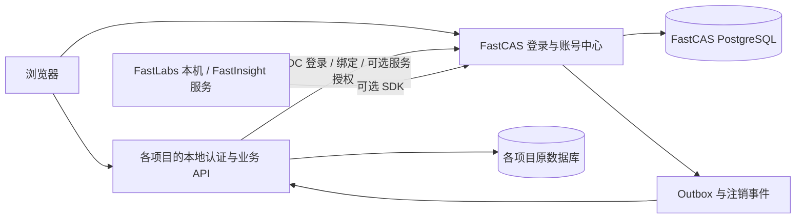

# 产品比较、技术选型与架构

## 外部产品调研

以下来源于 2026-09-22 访问的官方资料；“适用判断”是结合本地七项目得出的设计判断，不是产品性能基准。

| 路径 | 官方资料确认的形态 | 对 FastCAS 的适用判断 |
| --- | --- | --- |
| Casdoor | UI 优先的身份/SSO 产品，提供应用接入与 SDK。[官方概览](https://casdoor.ai/docs/overview/) | 可作为成品替代方案；需额外验证项目独立账号绑定的事务和撤销语义，不直接把其用户模型覆盖到七项目 |
| ZITADEL 成品 | 完整身份平台，可自托管，架构包含事件溯源/CQRS。[架构](https://zitadel.com/docs/concepts/architecture/software)、[文档](https://zitadel.com/docs) | 适合更大组织需求；当前七项目需要的薄身份层不必一开始引入整个平台模型 |
| Ory Hydra | Go OAuth/OIDC server，不负责用户管理，通过 login/consent 应用衔接身份。[官方仓库](https://github.com/ory/hydra) | 若嵌入库验证失败，可采用 Go FastCAS 管理/绑定层 + Hydra 协议服务；多一个进程与运维边界 |
| authentik | 应用与 provider 配对，支持 OAuth/OIDC 等协议。[Provider](https://docs.goauthentik.io/add-secure-apps/providers/)、[OIDC](https://docs.goauthentik.io/add-secure-apps/providers/oauth2) | 可借鉴应用注册和账号中心交互；不作为本轮 Go 自建后端的实现底座 |
| Go 嵌入协议库 | zitadel/oidc 有 RP/OP、PKCE、client credentials、device authorization、token exchange 等能力；Fosite 为可扩展 OAuth/OIDC 框架。[oidc](https://github.com/zitadel/oidc)、[Fosite](https://github.com/ory/fosite) | 推荐先验证 zitadel/oidc，以较少部署组件构建符合本项目绑定语义的服务；FastCAS 自行负责用户、数据库事务、风控和运维 |

这些方案都不能免除项目端绑定、账号冲突及本地数据归属工作。使用某个库也不代表 FastCAS 自动获得协议认证；上游 README 的认证范围必须与自建服务区分。

## 协议决定

**FastCAS 是产品名，不预设必须实现 Apereo CAS wire protocol。**

- 主路径用 OIDC Authorization Code + PKCE（S256），适合 Web 身份登录和三个 SDK。身份与授权分别处理。[OIDC Core](https://openid.net/specs/openid-connect-core-1_0.html)
- 按 OAuth 安全最佳实践约束 redirect、令牌和授权流程，不启用 implicit/password grant。[RFC 9700](https://www.rfc-editor.org/rfc/rfc9700.html)
- 原 Research 的 `?sso=` 私有协议保留在项目兼容适配层，不将其改名为标准 CAS。
- FastWrite 虽有 CAS client，但已有 OIDC client，因此七项目目前没有必须使用传统 CAS 的依赖。若后续有校内 CAS 系统需求，再明确是接入上游 CAS 还是 FastCAS 对外提供 CAS。[CAS 规范](https://apereo.github.io/cas/development/protocol/CAS-Protocol-Specification.html)

## 推荐技术栈

| 层 | 建议 | 理由及验证点 |
| --- | --- | --- |
| 后端语言 | Go 1.26 最新安全修订版；调研时 1.26.8 | 官方当前另有 1.27 系列，oidc README 支持表仍列 1.25/1.26；先取已确认交集，验证后升级。[Go release](https://go.dev/doc/devel/release) |
| 路由 | `net/http` + chi v5 | 原生 Handler 易挂载 OIDC 库；与 Gin 无关的 SDK 可供 FastTask 使用。[chi](https://github.com/go-chi/chi) |
| 协议内核 | `github.com/zitadel/oidc/v3` 候选固定版本 | P0 验证 code/PKCE、refresh 重放、存储事务、logout、device、exchange；不直接复制示例的内存存储 |
| 数据库 | PostgreSQL，一套生产与开发模式 | 绑定唯一性、一次性授权码和轮换依赖事务；开发提供 Compose，暂不承担 SQLite/PostgreSQL 双实现 |
| 数据访问 | pgx + sqlc + 版本化 SQL migration | 明确 SQL 锁和条件更新，便于审阅账号绑定事务。[pgx](https://github.com/jackc/pgx)、[sqlc](https://github.com/sqlc-dev/sqlc) |
| 前端 | React、TypeScript、Vite；Go embed 发布静态资源 | 与多数项目一致；管理控制台经自身服务端会话访问，不把管理员令牌放进浏览器持久存储 |
| 密码/MFA | Argon2id；TOTP + 一次性恢复码候选 | 哈希参数按目标硬件标定；凭证只属于 FastCAS；恢复码哈希存储，MFA seed 加密 |
| 签名 | 首发 RS256 + `kid` + JWKS | 与 FastWrite 现有验签兼容；签名库负责算法实现，业务层限制算法与用途 |
| 任务 | PostgreSQL outbox + 后台 worker | 处理绑定事件和注销重试；首发无需 Redis/Kafka；多实例用 lease/条件更新抢占 |
| 日志与可观测性 | slog、HTTP 指标、request_id；按需 OTel | 不记录 code、密码、token、Key 或完整绑定凭证 |
| API 契约 | OpenAPI 3.1 管理/绑定 API，标准协议单独测试 | 生成 DTO/普通 client；认证状态机由手写 SDK 包装，避免仅交付代码生成器产物 |

上述依赖只是选择范围，不使用 `latest` 作为可复现发布依据。P0 固定版本、许可证、最小运行时和漏洞扫描结果，写入锁文件和依赖清单。Go SDK 初版采用相同受支持 Go 基线，因此 FastTask 的 1.24.1 声明需在接入 PR 中单独升级并回归，而不是暗中由 SDK 拉高工具链。

## 系统边界

FastCAS 保存身份、凭证、应用实例、授权、绑定证明和安全审计。项目保存本地账号、会话、角色、工作区、所有权和业务内容。绑定不会要求两边共用数据库。

应用端接口隔离为 `LocalAccountStore`、`LinkStore`、`SessionStore`、`Reauthenticate`、`ProvisioningPolicy`；SDK 不调用各项目私有表，也不替项目实现 ACL。

## 账号与绑定一致性

规划中的中心表：

| 表/聚合 | 关键数据和约束 |
| --- | --- |
| `identities` / `credentials` | 稳定 subject、状态、认证方法；FastCAS 自有凭证 |
| `applications` / `client_credentials` | application 与部署实例；允许的 redirect、logout、scope、resource；凭证独立轮换 |
| `link_intents` | 应用实例、opaque local_account_ref、CAS subject、nonce、purpose、expires_at、状态；单次消费 |
| `account_links` | link_id、app_instance_id、local_account_ref、subject、status、version、verified_at、revoked_at |
| `sessions` / `refresh_families` | 来源、过期、撤销、轮换与重放状态 |
| `grants` / `service_accounts` | client 到资源的权限；用户委托和机器权限分开 |
| `outbox` / `delivery_attempts` | event_id、aggregate/version、目标、重试；消费者幂等 |
| `audit_events` | actor、操作、对象、结果、关联 request_id；不保存敏感请求体 |

MVP 活跃绑定唯一约束为 `(app_instance_id, local_account_ref)` 和 `(app_instance_id, subject)`，即每个部署实例的一对一绑定。不同项目/不同实例可以各有一个账号。未来多账号切换必须显式设计，不能默认随机选一个。

跨数据库不宣称原子提交：

1. 本地写 pending intent，记录已证明的本地账号和浏览器关联。
2. 完成 FastCAS 身份验证和确认，中心将绑定置为 prepared；此时不能用于登录。
3. 项目事务写 pending link；服务端幂等 activate 中心关系；再确认本地 active。
4. 某一步中断由相同 intent/idempotency key 重试或 reconcile；任何一边未 active 时拒绝该关系的 FastCAS 登录，不影响本地登录。
5. prepared 超期可回收；active 不因临时失联自动删除。撤销使用单调 version，旧事件不能使已撤销关系复活。

中心记录是认证关系状态依据，项目记录是本地账号映射与执行缓存。FastCAS 登录时需检查 active link 和本地用户状态；不能只验证 ID Token 签名就创建会话。

## 会话、撤销与可用性

下列数字是建议目标，需压测与集成验证：

- 授权码 60 秒且单次；绑定事务 5 分钟；登录 state 5 分钟；允许时钟偏移 60 秒。
- Access Token 5 分钟；刷新令牌逐次轮换、检测重放、按 family 撤销。应用必须串行化同一会话的刷新，避免并发误判重放。
- FastCAS SSO 会话建议 8 小时；项目本地会话期限仍由项目控制。
- 通过 FastCAS 签发的项目会话记录 `auth_source=fastcas`、`cas_sid`、link version，最长每 5 分钟重新确认有效性。中心不可用且有效性缓存过期后终止这类认证会话；用户可改用本地登录。独立 local 来源会话完全不查询中心。
- Back-channel logout 用标准签名 logout token，SDK 校验 issuer、audience、事件、sid/sub、iat 和 jti 防重放。[规范](https://openid.net/specs/openid-connect-backchannel-1_0.html)
- 绑定撤销另用有版本的 outbox 事件；网络正常时目标 30 秒内到达，不保证分布式瞬时注销。轮询/有效性到期兜底保证不无限延长。
- JWT 离线验签不等于即时撤销；服务高风险写操作需 introspection/绑定状态检查，不能引用“JWT 无状态”跳过禁用检查。

项目 Cookie 各自独立、HttpOnly、SameSite=Lax、生产 Secure，不设共享父域 Domain。本机同域不同端口仍须不同 Cookie 名。FastCAS 上游刷新令牌加密保存在项目服务端，浏览器只持项目会话。

## 部署与运行

规划 FastCAS 监听 `127.0.0.1:8900`（待检查端口），生产 `https://auth.<domain>`，通过反向代理 TLS；Research 8787、Labs 本机另分配端口。域名及回调 URI 由部署清单显式配置，不能由任意 Host/转发头推断。

单实例 Go + PostgreSQL + TLS 代理即可启动；多实例前验证数据库事务、分布式限速、注销事件 lease、会话共享与刷新并发。签名私钥从受控文件/密钥管理服务加载；JWT 公钥轮换保留覆盖仍有效令牌的验证窗口，紧急泄露时可提前撤销，不能继续按普通轮换信任旧键。

开发优先提供本地 HTTPS，兼容 FastWrite 已有校验；仅显式 dev 配置允许回环 HTTP，生产不得关闭 TLS 检查。分别测试浏览器可达的 issuer 与容器服务间可达地址，issuer 值不能随内外网不同而变化。

提供 live/ready、迁移命令、备份恢复演练；PostgreSQL 备份同时覆盖签名/加密密钥恢复流程。恢复旧快照后提升安全版本并撤销恢复前会话，防止旧绑定与令牌复活。建议初始可用性目标 99.9%，RPO 24 小时、RTO 4 小时，均为待运维确认目标。
